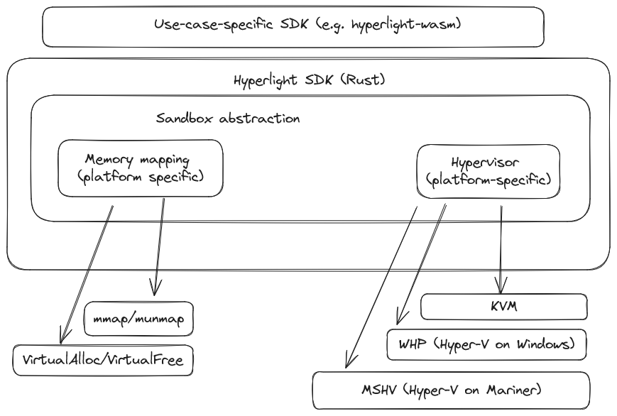

# Hyperlight Project Documentation

Hyperlight is a library for running hypervisor-isolated workloads without the overhead of booting a full guest operating system inside the virtual machine.

By eliminating this overhead, Hyperlight can execute arbitrary code more efficiently. It's primarily aimed at supporting functions-as-a-service workloads, where a user's code must be loaded into memory and executed very quickly with high density.

## Basics: Hyperlight internals

Hyperlight achieves these efficiencies by removing all operating system functionality from inside the virtual machine, and instead requiring all guest binaries be run directly on the virtual CPU (vCPU). This key requirement means all Hyperlight guest binaries must not only be compiled to run on the vCPU's architecture, but also must be statically linked to specialized libraries to support their functionality (e.g. there are no syscalls whatsoever available). Roughly similar to Unikernel technologies, we provide a guest library (currently in C, but we have some preliminary plans to move to Rust for in-guest binary execution) to which guest binaries can be statically linked.

Given a guest, then, Hyperlight takes some simple steps prior to executing it, including the following:

- Provisioning memory
- Configuring specialized regions of memory
- Provisioning a virtual machine (VM) and CPU with the platform-appropriate hypervisor API, and mapping memory into the VM
- Configuring virtual registers for the vCPU
- Executing the vCPU at a specified instruction pointer

## Basics: Hyperlight architecture

This project is composed internally of several internal components, depicted in the below diagram:

## Further reading

* [Glossary](./glossary)
* [How code gets executed in a VM](./hyperlight-execution-details)
* [How to build a Hyperlight guest binary](./how-to-build-a-hyperlight-guest-binary)
* [Security considerations](./security)
* [Technical requirements document](./technical-requirements-document)

## For developers

* [Security guidance for developers](./security-guidance-for-developers)
* [Paging Development Notes](./paging-development-notes)
* [How to use Flatbuffers in Hyperlight](./how-to-use-flatbuffers)
* [How to make a Hyperlight release](./how-to-make-releases)
* [Getting Hyperlight Metrics, Logs, and Traces](./hyperlight-metrics-logs-and-traces)
* [Benchmarking Hyperlight](./benchmarking-hyperlight)
* [Hyperlight Surrogate Development Notes](./hyperlight-surrogate-development-notes)
* [Debugging Hyperlight](./debugging-hyperlight)
* [Signal Handling in Hyperlight](./signal-handlers-development-notes.md)
