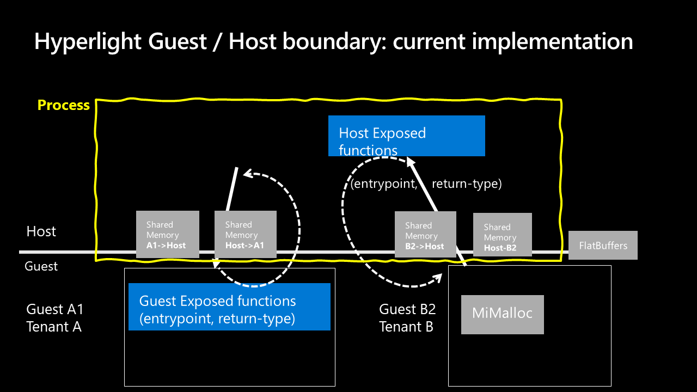

# Security Requirements for Hyperlight developers

This document discusses the security requirements and best practices for services building on Hyperlight.

These requirements are designed to uphold the security promise around the guest to host boundary:

.

These are designed to prevent a malicious guest from attacking a host or other guests. These become even more critical in a multi-tenant scenario.

## Terminology
* _MUST_, _MUST NOT_ -- A security requirement that is mandatory to perform, or not to perform, respectively.
* _SHOULD_, _SHOULD NOT_ -- A security recommendation is encouraged to perform, or not perform, respectively.

## Brief Checklist
* All host exposed functions that either receive one parameter from a guest or operate indirectly on guest data _MUST_ be continuously fuzzed
* The host program _MUST_ be in a memory safe language with automated memory management
*  Host exposed functions _MUST NOT_ call APIs or expose functionality deemed risky in a multi-tenant context
* Guests and host processes _MUST_ use the same version of a FlatBuffer definition
*  Static Analysis _MUST_ run at every PR as a blocking workflow
*  A Rust process _SHOULD_ handle panics

More detailed guidance on the requirements and best practices is detailed below.


## All host exposed functions that receive or interact with guest data _MUST_ be continuously fuzzed
In the case of the host function calling guest functions, there will be the need to mock callees. Thus, be aware it may not be an identical state machine, thus have different bugs.
A host exposed function should be able to execute at least 500 million of fuzz test cases iterations without any crash.

For rust code, Cargo-fuzz is the recommended way to harness and satisfy the fuzzing requirements. An example with a complete example implementation can be found [Fuzzing with cargo-fuzz - Rust Fuzz Book (rust-fuzz.github.io)](https://rust-fuzz.github.io/book/cargo-fuzz.html). 

```rust
#![no_main]
#[macro_use] extern crate libfuzzer_sys;
extern crate url;

fuzz_target!(|data: &[u8]| {
    if let Ok(s) = std::str::from_utf8(data) {
        let _ = url::Url::parse(s);
    }
});
     
```
 
## The host program _MUST_ be in a memory safe language with automated memory management
This includes Rust and any language written via a .NET runtime (C#, ...).

## The host program _MUST NOT_ introduce the possibility of any memory safety issue.

Thus, for Rust code, the host program _MUST NOT_ use the "unsafe" keyword functionality nor link with memory unsafe libraries. 
`#![forbid(unsafe_code)]` _MUST_ be used to explicitly prevent such uses. Any rust code not having this preprocessing _MUST_ receive a security code audit.

## Host exposed functions _MUST NOT_ call APIs or expose functionality deemed risky in a multi-tenant context

In a multi-tenant context, the following operations are considered security sensitive:
* File creation and manipulation
* Shared Data store access
* Accessing network resources
* Resource allocation and usage: if not designed properly, one guest may exhaust the resources for other tenants
* Managing encryption keys

If any of these operations is performed in a host process, a security audit _MUST_ occur.

## Flatbuffers - Guests and host processes _MUST_ use compatible versions of a FlatBuffer definitions

The guests and host processes _MUST_ use the exact same versions of a FlatBuffer definition. I.e., the same .fbs file _MUST_ be used for generating the encoders and decoders.

## Flatbuffers - If using the same language for development, the guests and host processes _SHOULD_ use the same version of flatc/flatcc compilers.

This can be seen in the header files containing FLATBUFFERS_COMMON_READER_H. For instance:  `/* Generated by flatcc 0.6.2 FlatBuffers schema compiler`.
We emit this recommendation because there is a history of compiler bugs, which may affect certain behaviors (encoding, decoding). We emit this recommendation because there is a history of compiler bugs, which may adversely affect certain behaviors (encoding, decoding).

## Flatbuffers – a verifier should always be called before any decoder. In the case of failed verification, the input _MUST NOT_ be processed.

For Rust code, if the return code is InvalidFlatBuffer, the input _MUST_ be rejected. flatbuffers - Rust (docs.rs). For C code, it _MUST_ assert() on correctly verifying before processing.


## Flatbuffers – the host process _MUST NOT_ operate on Flatbuffers from several threads.

Because of the zero-copy approach that FlatBuffers is using, there is a risk of memory safety issues. Flatbuffers are unsafe to be used in a multithreaded environment. This is explicitly indicated in several parts of the Flatbuffer documentation.

Additionally, because Flatbuffers tainted data coming from the guests, this is even more critical in a multi-tenant scenario.

For Rust code, if the return code is InvalidFlatBuffer, the input _MUST_ be rejected. flatbuffers - Rust (docs.rs). For C code, it _MUST_ assert() on correctly verifying before processing.


 ## Static Analysis _MUST_ run at every PR as a blocking workflow for security bugs of at least medium level

For Rust code, clippy  must be run. [rust-lang/rust-clippy](https://doc.rust-lang.org/clippy/): A bunch of lints to catch common mistakes and improve your Rust code.

 
## A rust host process _SHOULD_ handle [panics](https://doc.rust-lang.org/book/ch09-03-to-panic-or-not-to-panic.html) or the service _SHOULD_ restart automatically
 
If the error is recoverable, the service _SHOULD_ process the next input. Otherwise, the service _SHOULD_ gracefully  restart.
